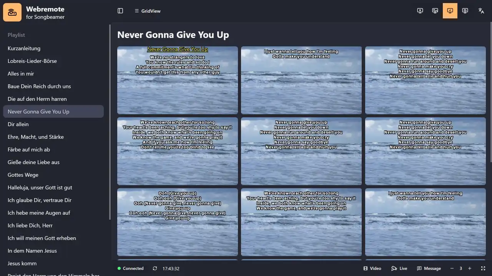

# Webremote for Songbeamer

    
    

 

"Webremote for Songbeamer" is an unofficial app that allows you to control [Songbeamer](https://www.songbeamer.de/) from a separate device over the network. It runs on Tablets, Phones, PCs and any device with a modern web browser. This way you can control Songbeamer from anywhere without having to be in front of the computer that runs it.

    

## Installation and Usage

Webremote for Songbeamer requires a separate program that runs beside Songbeamer and acts as a bridge for the OSC interface. To setup the webremote, follow these steps:

1. Install Songbeamer on your computer if you haven't done so already. You can get it from [here](https://www.songbeamer.de/).
2. Open Songbeamer and enable OSC support.
    1. Open songbeamer and navigate to `Extras` > `Midi / OSC Setup...`
    2. Switch to the OSC tab and check the box to enable OSC support
    3. Have a look at the specified port. Use port 10023 or reconfigure the webremote to your desired port later.
    4. Click `OK`, then close and reopen Songbeamer
3. Download the latest release of the webremote from [here](https://github.com/todm/webremoteForSongbeamer/releases/latest) and extract the zip file to a folder of your choice
    - The program has to be run on the same device that is running Songbeamer. It will not work if you run it on a different device.
4. Run the server by executing `WebremoteForSongbeamer.exe`. You should see a terminal window saying "_Starting server on port 10024_".
5. Open the webremote in a browser of your choice
    - The program will print out all available ip addresses of the device it runs on.
    - If you want to open it on the same device you can use its local ip address: http://localhost:10024 or http://127.0.0.1:10024
    - If you want to open it on another device in the same network you have to use its external ip address. It should look something like this: http://192.168.1.xx:10024
    - If you run into trouble, make sure that your firewall allows incoming connections on the port you specified (default: 10024)

> [!CAUTION]
> There is no further authentication required to access the webremote. To prevent unauthorized access, make sure to only run the server on a trusted network.

## Compatibility

Webremote for Songbeamer was primarily developed for Windows.
It should run on macOS as well but since thumbnail capturing currently uses windows internal APIs it's restricted to pdf and text previews. It's also untested.

You need a Songbeamer version that supports OSC. For development version 6.16 was used, but any recent version should work.

Some features like WakeLock and PWA Application support are only available over a trusted https connection. If you need them either provide a certificate or use a separate reverse proxy.

## Configuration

The webremote can be configured through the `webremote.config.json` which should be located in the same directory as the server executable. If it does not exist, it will be created automatically when you run the server for the first time. You can edit the configuration file with any text editor of your choice. To reset the configuration to its default values, simply delete the file and restart the server. The following configuration options are available:

| Option               | Description                                                                                                                                 | Default Value     |
| -------------------- | ------------------------------------------------------------------------------------------------------------------------------------------- | ----------------- |
| `Port`               | The port on which the webremote server will listen for incoming connections.                                                                | `10024`           |
| `SongbeamerAddr`     | The address of the songbeamer osc interface.                                                                                                | `127.0.0.1:10023` |
| `UseTLS`             | Whether the server should use TLS. (Needs CertFile and KeyFile to be set)                                                                   | `false`           |
| `CertFile`           | The path to the TLS certificate file.                                                                                                       | `""`              |
| `KeyFile`            | The path to the TLS key file.                                                                                                               | `""`              |
| `ThumbnailQuality`   | The jpg quality of the thumbnails generated by the webremote. (1-100)                                                                       | `50`              |
| `ThumbnailSkipReset` | Skip resetting the songbeamer window after thumbnail capture (might improve performance but can cause issues)                               | `false`           |
| `StaticDir`          | Path for the static files of the webremote. If you want to use your own webremote build, you can set this to the path of your build folder. | `./static`        |

Additionally you can configure the webremote frontend directly in the browser. Open the settings menu or navigate to `http://<myAddress>/settings`. The settings are saved per browser and device. These settings should be self-explanatory.

## Development and Contributing

This project was built by hand. No vibe code generation. AI may be used for research. Contributions are welcome, however unchecked AI generated code will be rejected. Please make sure to follow the coding style and conventions used in the project.

If you have any questions or suggestions, feel free to open an issue.

_This project is not affiliated with or endorsed by Songbeamer_